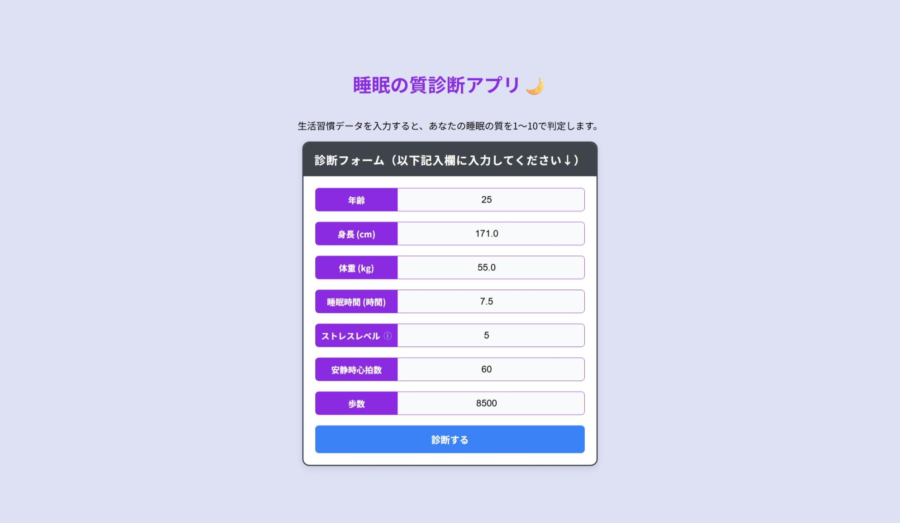

# 睡眠の質診断アプリの開発

生活習慣データから睡眠の質（Quality of Sleep）を予測する機械学習Webアプリ

## プロジェクト概要

Kaggleで公開されている **Sleep Health and Lifestyle Dataset** を用いて、生活習慣データから睡眠の質を予測する機械学習モデルを構築しました。

本プロジェクトでは、

- EDA（探索的データ分析）
- データ前処理
- 特徴量選定
- 複数モデルの比較
- SHAPによるモデル解釈
- Flaskを用いたWebアプリ化

まで一貫して実施しています。

予測精度だけでなく、ユーザーが入力しやすく、改善行動につながる実用的なアプリを目指しました。

---

# システム構成

```
生活習慣データ入力
        │
        ▼
データ前処理
（BMI生成・カテゴリ変換）
        │
        ▼
Gradient Boosting Regressor
        │
        ▼
睡眠の質を予測
        │
        ▼
結果画面に表示
```

---

# 使用技術

## バックエンド

- Python
- Flask

## 機械学習

- scikit-learn
- Pandas
- NumPy
- Joblib

## 可視化

- Matplotlib
- Seaborn
- SHAP

## フロントエンド

- HTML
- CSS
- JavaScript

## その他

- Git
- GitHub
- Jupyter Notebook

---

# データセット

**Sleep Health and Lifestyle Dataset**

### データ概要

- レコード数：374件
- 特徴量：13項目
- 目的変数：Quality of Sleep
- 問題設定：回帰

入力データには

- 年齢
- 性別
- 睡眠時間
- 運動量
- ストレスレベル
- BMI
- 心拍数
- 歩数

などが含まれています。

---

# EDA（探索的データ分析）

以下の分析を実施しました。

- データ構造の確認
- 欠損値確認
- 数値データの分布
- カテゴリ変数分析
- 相関分析
- 睡眠の質との関係分析

---

## BMI分析

データには

- Normal
- Normal Weight

という実質同じカテゴリが存在していたため統合しました。

睡眠の質の平均

|BMI|Quality of Sleep|
|---|---|
|Normal|7.66|
|Overweight|6.90|
|Obese|6.40|

BMIが高くなるほど睡眠の質が低下する傾向が確認されました。

---

## 性別分析

睡眠の質の平均

|Gender|平均|
|---|---|
|Female|7.66|
|Male|6.97|

一方で、女性サンプルには高年齢層が多く含まれており、年齢構成の偏りが存在することを確認しました。

そのため、

> 女性だから睡眠の質が高い

とは断定できず、他の特徴量の影響も考慮する必要があると考察しました。

---

## 年齢分析

EDAでは年齢が高いほど睡眠の質が高いように見えました。

しかし実際には

- 高年齢層のサンプル数
- 年齢分布

に偏りが見られたため、

データセット固有の特徴による影響が考えられました。

---

## 職業分析

職業ごとに睡眠の質には違いが見られました。

しかし

- サンプル数の偏り
- ユーザーが変更できない情報

であることから、

アプリの入力項目には採用しませんでした。

---

# 特徴量選定

EDAとモデル評価を踏まえ、

以下の観点で特徴量を選定しました。

- ユーザーが入力しやすい
- 改善行動につながる
- 予測精度が高い

最終的に採用した特徴量

- Age
- Sleep Duration
- Stress Level
- Heart Rate
- Daily Steps
- BMI Category

BMIは

- 身長
- 体重

からアプリ内で自動計算しています。

Genderについてはモデル比較を行った結果、

**Genderを除外したモデルの方が予測性能が向上したため、最終モデルでは採用していません。**

---

# モデル構築

以下の回帰モデルを比較しました。

- Linear Regression
- Random Forest Regressor
- Gradient Boosting Regressor

評価指標

- MAE
- RMSE
- R²

最終的に **Gradient Boosting Regressor** を採用しました。

---

# SHAPによる特徴量分析

SHAPによる特徴量重要度を分析しました。

結果として

1. Sleep Duration
2. Stress Level
3. Heart Rate
4. Age
5. Daily Steps

の順に重要度が高いことが分かりました。

一方で

- Gender

の寄与はほぼ見られませんでした。

EDAでは男女差が確認されましたが、

モデルでは

> 性別そのものではなく、睡眠時間やストレスレベルなどの生活習慣が睡眠の質を説明している

ことが示唆されました。

---

# 実装済み機能

- 機械学習モデル構築
- 前処理パイプライン
- 学習済みモデル保存
- FlaskによるWebアプリ
- BMI自動計算
- 睡眠の質予測
- 推論結果表示
- 各項目の入力値に基づく睡眠改善アドバイスの表示


---

# 今後の改善

## データセットの拡充

本プロジェクトで使用した「Sleep Health and Lifestyle Dataset」では、
目的変数である **Quality of Sleep** の値が **4〜9** の範囲に限られていました。

そのため、睡眠の質が極端に低いケース（1〜3）のデータが存在せず、
予測結果も4未満を出力することができませんでした。

今後は、より幅広い睡眠の質を含むデータセットを用いることで、
睡眠の質が非常に低いユーザーに対しても適切な予測ができるモデルへ改善したいと考えています。

## データの偏り

EDAでは、

- 高年齢層のサンプル構成
- 性別の年齢分布
- 職業ごとのサンプル数

などに偏りが見られました。

そのため、今回得られた分析結果はデータセット固有の特徴を含んでいる可能性があります。

今後は、年齢・性別・職業などの分布がより均一なデータや、別のデータセットでも検証を行い、モデルの汎化性能を評価したいと考えています。

## アプリ機能の改善

現在は睡眠の質の予測のみを行っていますが、今後は

- SHAPを利用した予測理由の表示
- 入力履歴の保存
- 結果の可視化

などを実装し、より実用的な睡眠診断アプリへ発展させたいと考えています。

---

# 学び

本プロジェクトでは、

- EDAから仮説を立てる
- モデル比較を行う
- SHAPで予測根拠を分析する
- 実用性を考慮して特徴量を選定する

という、機械学習プロジェクトの一連の流れを経験しました。

特に、

EDAでは男女差が見られたものの、SHAPおよびモデル比較ではGenderの寄与がほとんど見られなかったことから、

**平均値だけでは分からない特徴量同士の関係を、機械学習によって確認できたことが本プロジェクトで最も大きな学びでした。**